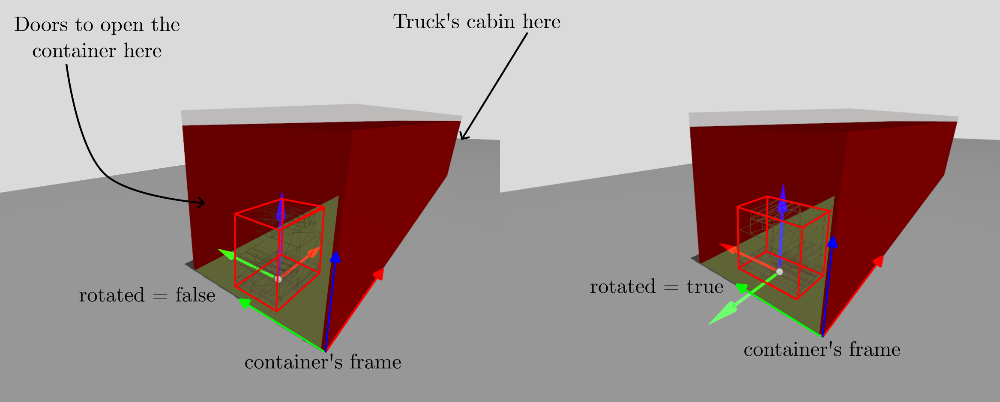

# cargo_planner

ROS2 node that plans how to place cargo units inside a container. The workflow is phased: first the container occupancy grid and the cargo list are registered, then the planning action is called to compute the placements and the free-space map.

## Interfaces

| Interface | Type | Description |
|---|---|---|
| `container_occupancy_grid_registration` | `cargo_planner_msgs/ContainerOccupancyGridRegistration` | Store the container grid map |
| `cargo_list_registration` | `cargo_planner_msgs/CargoListRegistration` | Store the list of cargo units |
| `cargo_planning` | `cargo_planner_msgs/action/PlanCargo` | Run the placement algorithm |
| `cargo_markers` | `visualization_msgs/MarkerArray` | Publish cargo markers for RViz |
| `container_free_map` | `nav_msgs/OccupancyGrid` | Publish the remaining free map |

## Typical flow

Phase 1:

- Register the container occupancy grid.
- Register the cargo list.

Phase 2:

- Call `cargo_planning`.

The two registrations can happen in any order. Both must be set before the planning action is sent. Calling them again replaces the stored data.

## Quick start

```bash
# 1. Launch the node
ros2 launch cargo_planner cargo_planner.launch.py namespace:=cargo_plan

# 2. Publish a synthetic container grid
ros2 run cargo_planner synthetic_container_occupancy_grid_publisher.py \
  --ros-args \
  -p container_length:=13.6 \
  -p container_width:=2.4 \
  -p pre_loaded_pallets:=0 \
  -r container_occupancy_grid:=container_inspector/container_occupancy_grid

# 3. Forward the grid topic to the planner service
ros2 run cargo_planner container_occupancy_grid_forwarder.py \
  --ros-args \
  -p container_height:=2.38 \
  -r container_occupancy_grid:=container_inspector/container_occupancy_grid \
  -r container_occupancy_grid_registration:=cargo_plan/container_occupancy_grid_registration

# 4. Register the cargo list
ros2 service call /cargo_plan/cargo_list_registration \
  cargo_planner_msgs/srv/CargoListRegistration \
  "{cargo_units: [{id: 'c1', lx: 1.2, ly: 0.8, lz: 1.5}, {id: 'c2', lx: 1.2, ly: 0.8, lz: 1.5}]}"

# 5. Run the planner
ros2 action send_goal /cargo_plan/cargo_planning cargo_planner_msgs/action/PlanCargo "{}"
```

## Parameters

The launch file loads `config/example_cargo_planner.yaml` by default. You can
pass `params_file:=/path/to/your.yaml` to use another file, and you can
override individual parameters from the CLI.

| Parameter | Default | Description |
|---|---|---|
| `occupied_threshold` | `65` | Cells at or above this value are treated as occupied |
| `pallet_margin` | `0.05` | Safety margin used around obstacles [m] |
| `enable_rotation` | `true` | Allow cargo units to be placed at 90 degrees yaw |

## Cargo unit convention


- A cargo unit is a rectangular load in the container XY plane.
- The planner treats cargo as a rectangular footprint and does not model overhang beyond the pallet footprint.
- `enable_rotation` controls whether the planner may also test the cargo unit at 90 degrees yaw.

## Cargo frame convention


- The cargo unit X axis follows the pallet length.
- The cargo unit Y axis follows the pallet width.
- The cargo unit Z axis is vertical.
- `CargoPlacement.rotated` tells you whether the final placement uses the original orientation or the 90 degrees yaw orientation.

## Container frame convention



- The container occupancy grid defines the `container_frame` used by the planner.
- The planner reports each placement as the 3D center pose of the cargo unit in that frame.
- The container length and width are inferred from the occupancy grid metadata.
- The container height is provided in `container_occupancy_grid_registration` because it is not present in `nav_msgs/OccupancyGrid`.

## Notes

- The planner works with rectangular cargo units.
- If `enable_rotation` is `false`, only the original orientation is considered.
- The node publishes markers and the free map only after a successful planning action.

## Tests

```bash
colcon test --packages-select cargo_planner
colcon test-result --verbose
```
